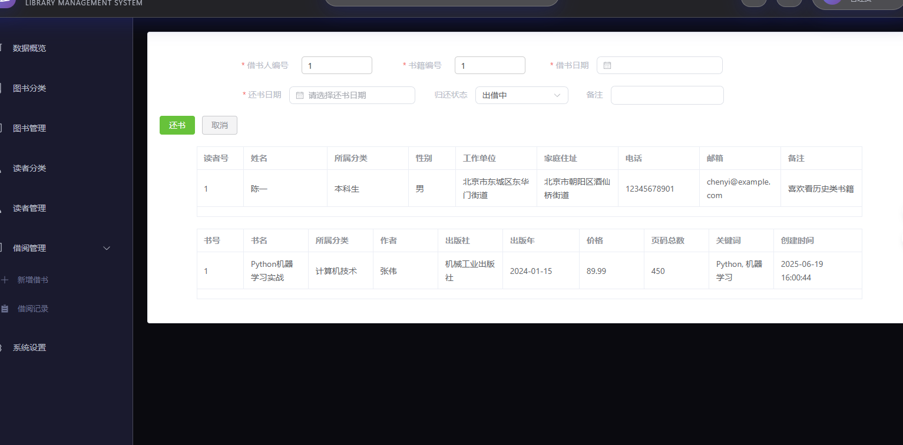

# 📚 图书管理系统

> 基于 Vue3 + Spring Boot + MySQL 的现代化图书管理系统

[](https://vuejs.org/)
[](https://spring.io/projects/spring-boot)
[](https://www.mysql.com/)
[](https://www.typescriptlang.org/)

## ✨ 项目简介

这是一个功能完整的图书管理系统，采用前后端分离架构设计，实现了图书馆信息管理的系统化、规范化和自动化。系统支持图书管理、读者管理、借还书管理以及数据统计分析等核心功能。

## 🚀 快速开始

### 环境要求

- **前端**: Node.js 16+
- **后端**: JDK 17+, Maven 3.6+
- **数据库**: MySQL 8.0+
- **开发工具**: IntelliJ IDEA (推荐)

### 安装步骤

1. **克隆项目**
   ```bash
   git clone <repository-url>
   cd library-manage
   ```

2. **数据库初始化**
   ```bash
   # 在 MySQL 中执行 SQL 文件
   mysql -u root -p < library.sql
   ```

3. **后端启动**
   ```bash
   cd server
   mvn clean install
   mvn spring-boot:run
   ```

4. **前端启动**
   ```bash
   cd web
   npm install
   npm run dev
   ```

5. **访问系统**
   - 前端地址: http://localhost:5173
   - 后端地址: http://localhost:8080

## 🎯 核心功能

### 📖 图书管理
- 图书分类管理（增删改查）
- 图书信息管理（录入、查询、更新、删除）
- 图书状态跟踪（在库/借出/损坏等）
- 多条件检索（书名、作者、出版社、关键词等）

### 👥 读者管理
- 读者分类管理（本科生、硕士生、博士生、教职工）
- 读者信息管理（个人信息、联系方式等）
- 借阅权限控制（借书数量、期限等）

### 🔄 借还书管理
- 借书登记（选择读者和图书）
- 还书处理（正常归还、逾期归还、损坏归还等）
- 借阅记录查询和统计
- 逾期提醒功能

### 📊 数据统计
- 图书分类统计图表
- 读者分类统计图表
- 借还书趋势分析
- 热门图书排行榜
- 活跃读者排行榜

### 🔐 系统管理
- 管理员登录/注册
- JWT 身份认证
- 密码加密存储


## 🏗️ 技术架构

### 前端技术栈
- **框架**: Vue 3.4.21 + TypeScript 5.4.0
- **构建工具**: Vite 5.1.6
- **UI 组件库**: Element Plus 2.6.3
- **状态管理**: Pinia 2.1.7
- **图表库**: ECharts 5.5.0
- **样式预处理**: Less 4.2.0
- **HTTP 客户端**: Axios 1.6.8

### 后端技术栈
- **框架**: Spring Boot 3.2.5
- **数据库**: MySQL 8.0+
- **ORM 框架**: MyBatis 3.0.3
- **身份认证**: JWT
- **密码加密**: MD5
- **构建工具**: Maven

### 项目结构
```
library-manage/
├── web/                    # 前端项目
│   ├── src/
│   │   ├── views/         # 页面组件
│   │   ├── router/        # 路由配置
│   │   ├── stores/        # 状态管理
│   │   └── utils/         # 工具函数
│   └── package.json
├── server/                 # 后端项目
│   ├── common/            # 公共模块
│   ├── pojo/              # 实体类模块
│   ├── server/            # 服务模块
│   │   ├── controller/    # 控制器层
│   │   ├── service/       # 服务层
│   │   └── mapper/        # 数据访问层
│   └── pom.xml
├── library.sql            # 数据库初始化脚本
└── images/                # 项目截图
```

## 🗄️ 数据库设计


### 数据表结构

| 表名 | 说明 | 主要字段 |
|------|------|----------|
| `r_category` | 读者分类表 | id, name, amount, lend_period, effect_period |
| `reader` | 读者信息表 | id, name, category_id, sex, phone, email |
| `b_category` | 图书分类表 | id, name, keywords, notes |
| `book` | 图书信息表 | id, name, category_id, author, press, price, status |
| `lend_return` | 借还书记录表 | id, r_id, b_id, lend_date, return_date, status |
| `manager` | 管理员表 | id, name, password |

### 设计亮点

**智能状态管理**: 借还书记录表设计了完善的状态系统：
- `0` - 出借中
- `1` - 正常归还
- `2` - 逾期归还
- `3` - 丢失无法归还
- `4` - 损坏归还
- `5` - 其他情况

通过状态码实现图书流转的精确跟踪，确保数据一致性。


## 📱 功能展示

### 数据统计大屏
采用 ECharts 可视化库，提供丰富的数据分析图表：

.png)


### 图书管理
完整的图书生命周期管理，支持分类管理和详细信息维护：

.png)

.png)

### 读者管理
灵活的读者分类体系，支持不同类型读者的差异化管理：

.png)

.png)

### 借还书流程
直观的借还书操作界面，支持状态可视化管理：

.png)

.png)



### 系统管理
安全的管理员认证体系，支持多管理员协作：

.png)


## 🔧 开发架构

### 后端分层架构

**Controller 层**: 处理HTTP请求，参数校验，调用Service层
**Service 层**: 业务逻辑处理，事务管理，调用Mapper层
**Mapper 层**: 数据访问层，SQL语句执行，数据库操作

### 模块化设计
- **common**: 公共工具类、常量定义、异常处理
- **pojo**: 实体类、DTO、VO等数据传输对象
- **server**: 核心业务模块，包含三层架构

### 数据校验与异常处理
- 前端表单校验 + 后端参数校验双重保障
- 自定义异常类，统一异常处理机制
- Element Plus 消息提示，用户体验友好

## 🛡️ 安全特性

- **身份认证**: JWT Token 机制
- **密码安全**: MD5 加密存储
- **数据校验**: 前后端双重校验
- **SQL 注入防护**: MyBatis 参数化查询
- **权限控制**: 基于角色的访问控制

## 📈 性能优化

- **分页查询**: PageHelper 插件，大数据量友好
- **连接池**: HikariCP 高性能数据库连接池
- **缓存机制**: 合理使用缓存减少数据库压力
- **前端优化**: 路由懒加载，组件按需引入

